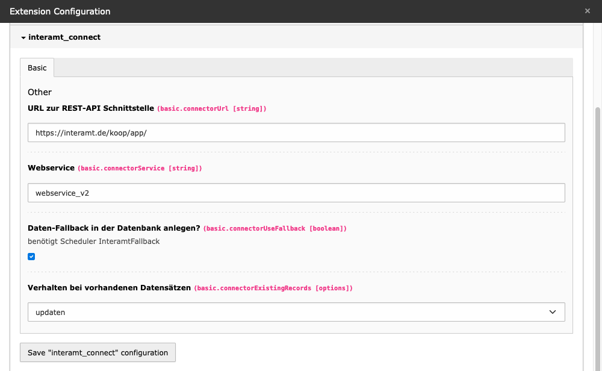
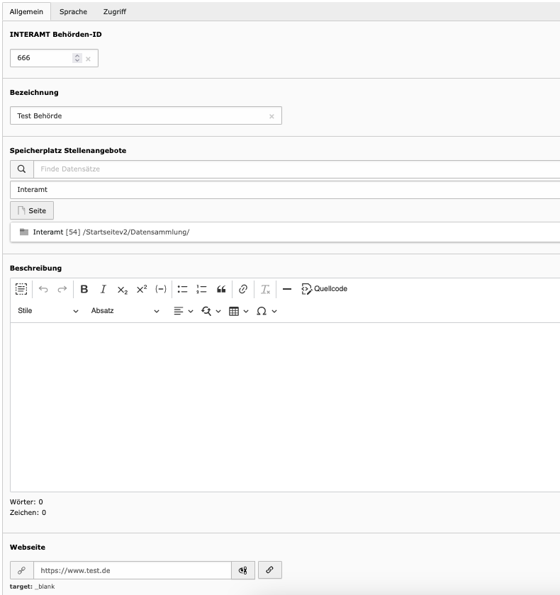
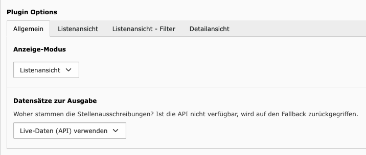
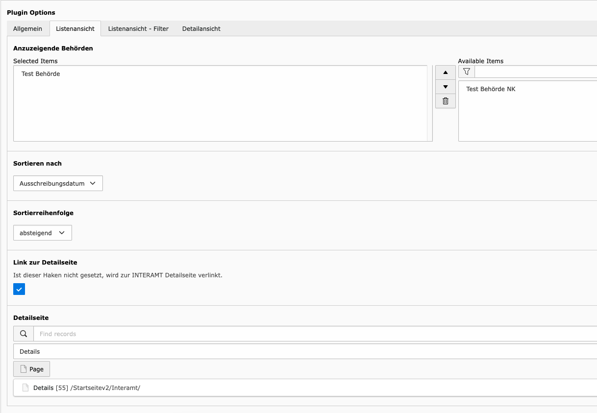
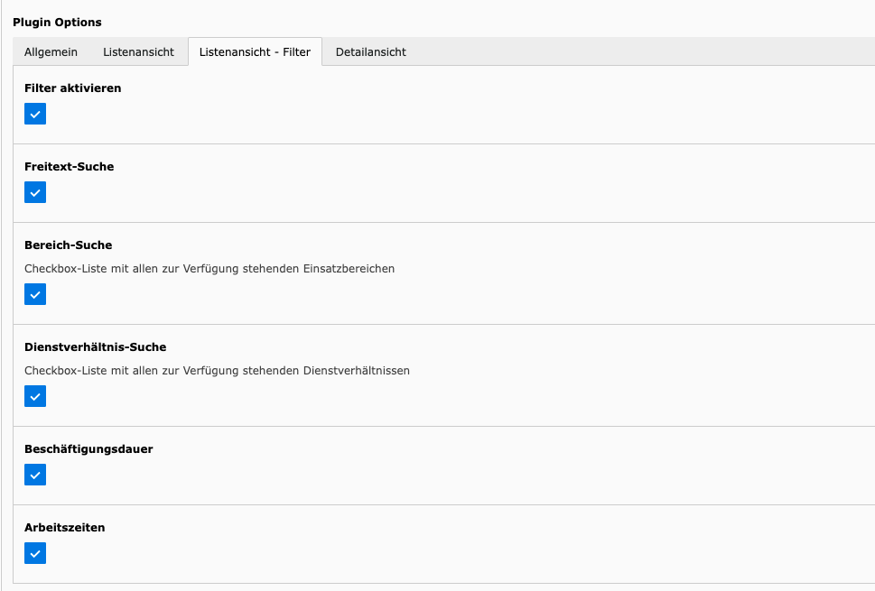
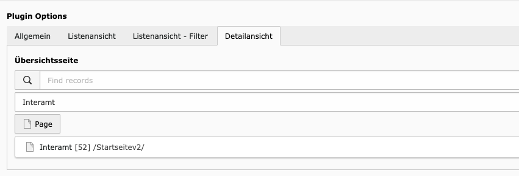
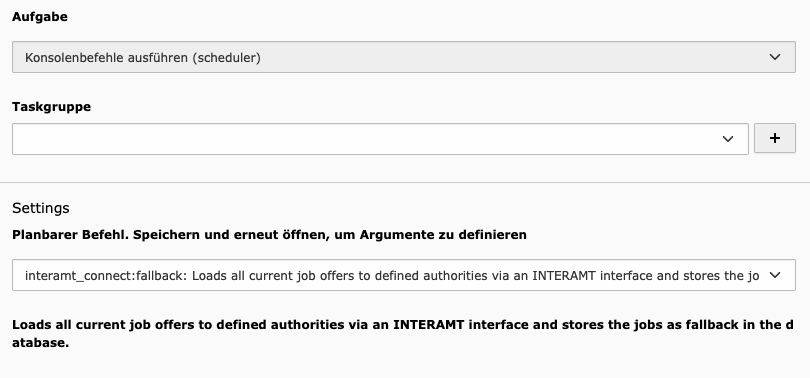

# TYPO3 extension ``interamt_connect``

## What does it do?

Creates an overview of all job advertisements of a public authority, which are listed in the public service job portal INTERAMT.de.

Alternatively, a task can be used to load all job offers as a fallback from INTERAMT and build the output using the data from the extension tables.

## Installation

### Installation using composer

The recommended way to install the extension is by using Composer. In your Composer based TYPO3 project root, just do

     composer require wsbusch/interamt-connect

### Installation as extension from TYPO3 Extension Repository (TER)

Download and install the extension with the extension manager module.

> After installation, do not forget to include the static template "Interamt Connector".

## Extension Configuration

In order for the job offers to be loaded via the INTERAMT API, this must be set up in the extension configuration.

### `connectorUrl`
URL to the INTERAMT interface 

### `connectorService`
Name of the current valid web service

### `connectorUseFallback`
Specifies whether the job offers are to be loaded via the interface and stored in the database.

### `connectorExistingRecords`
How should the fallback task behave if an already existing job is found in the database. Identifier is the INTERAMT UID.

## Manage authorities

> Each authority listed with INTERAMT has a unique authority identifier. This is necessary to communicate with the INTERAMT API.

> 1. Select directory
> 2. Create new record
> 3. Interamt Connector: Behörden

### `INTERAMT Behörden-ID`
UID assigned by INTERAMT for this authority. Is needed to load the job advertisements via the API.

### `Bezeichnung`
Is output in the overview of job postings and is used for internal identification purposes.

### `Speicherplatz Stellenangebote`
In which directory should job postings retrieved via the fallback task for this agency be stored?

### `Beschreibung`
Description or remarks about the authority, which can be output in the template.

### `Webseite`
URL to the authority homepage

## Plugin Configuration
The Interamt Connector plugin has two display modes

> 1. list view
> 2. detail view

Depending on the mode, the plugin configuration is stored in different tabs.

### General

### `Anzeige-Modus`
Which mode should be displayed?

### `Datensätze zur Ausgabe`
Where do the data records that are to be output come from?
> - Live data from the API
> - Using data from fallback

### List-View

### `Anzuzeigende Behörden`
Which authorities should be output in the plugin?
*Multiple entries possible*

> See: Manage authorities

### `Sortieren nach`
How should the records be sorted?
> - Ausschreibungsdatum (Tender date) (default)
> - Stellenbezeichnung (Title)

### `Sortierreihenfolge`
Order of sorting
> - aufsteigend (ascending)
> - absteigend (descending) (default)

### `Link zur Detailseite`
If this checkbox is activated, the details of the advertisement are loaded via the internal "Details page".
If the checkbox is not set, a link to the details page on INTERAMT.de will be output.

### `Detailsseite`
Internal page with the details of the job posting
> Only necessary if "Link zur Detailseite" is activated.

### List-View Filter

The list view is filterable via several options defined by INTERAMT.  
The individual filters can be activated via this tab.

*The filters are effective for the live data search as well as for the search via the fallback data.*

### `Filter aktivieren`
The individual filters only take effect if this checkbox is activated.

### `Freitext-Suche`
Searches all relevant fields for the specified values.

### `Bereich-Suche`
Several entries can be selected from a list of application areas predefined by INTERAMT. (e.g. Justice, Health, General Administration, etc.).

> The list can always be extended by INTERAMT. Adaptions are provided as [FEATURE] version through an update.

### `Dienstverhältnis-Suche`
A checkbox selection is included with the employment statuses "Civil servant", "Employee" and "Training/Internship/Dual studies".

### `Beschäftigungsdauer`
A checkbox selection with "unlimited", "limited, option unlimited" and "limited" is included.

### `Arbeitszeiten`
A checkbox selection with "part-time", "full-time" and "both possible" is included.

### Detail-View

Shows the complete job posting with contact information and other options.

### `Übersichtsseite`
Is needed for the "Back to overview" link.  
If this entry is not set, no link is output.

## Scheduler Task

The task `interamt_connect:fallback` can be triggered via a console command.

This task loads all current job advertisements of the defined authorities via the INTERAMT API and stores them in the database.

____

|                  | URL                                                     |
|------------------|---------------------------------------------------------|
| **Repository:**  | https://github.com/WSBusch/interamt_connect             |
| **TER:**         | https://extensions.typo3.org/extension/interamt_connect |